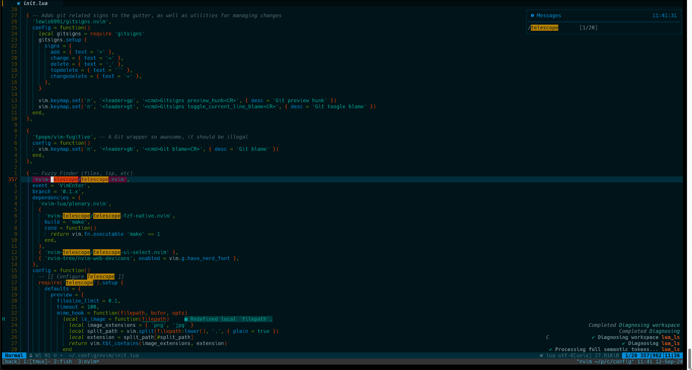
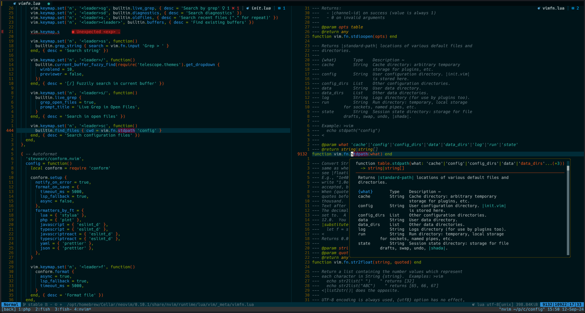
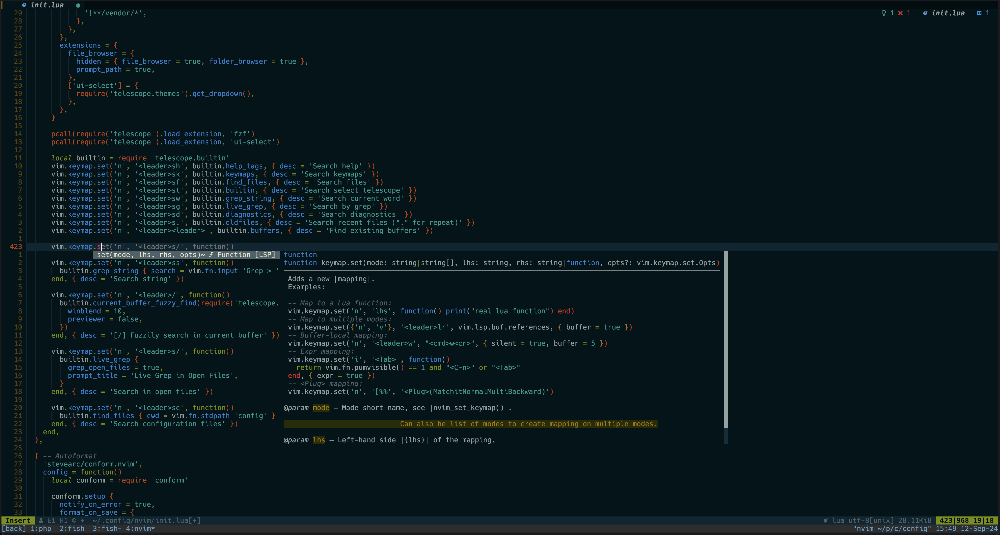
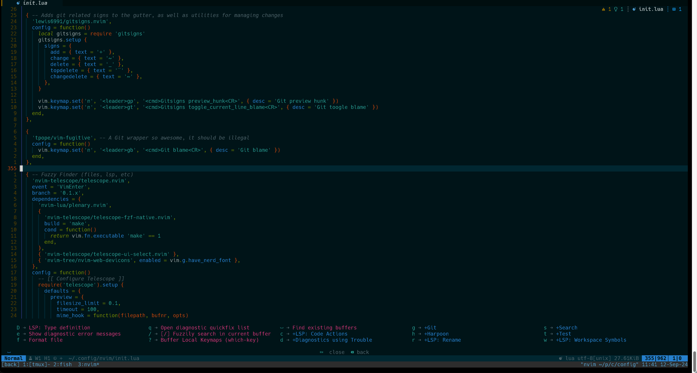
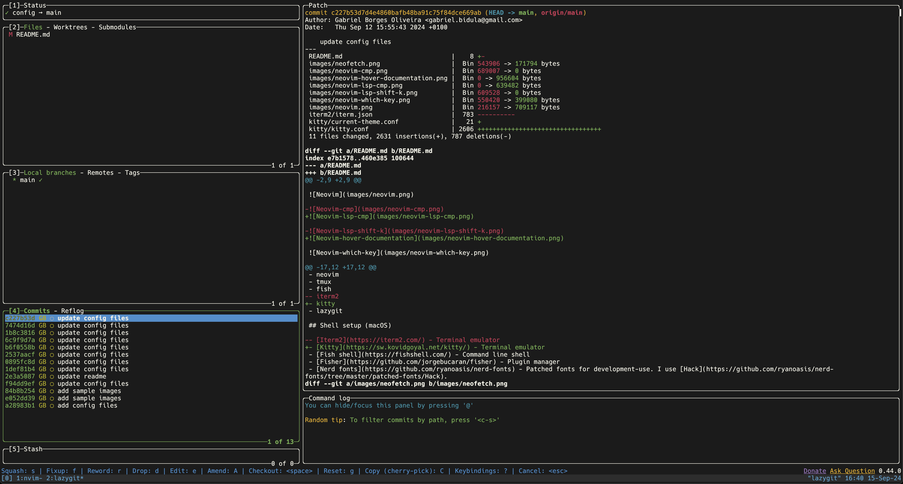

# Gabriel's dotfiles

## Contents

- neovim
- tmux
- fish
- kitty
- lazygit

## Shell setup (macOS)

- [Kitty](https://sw.kovidgoyal.net/kitty/) - Terminal emulator
- [Fish shell](https://fishshell.com/) - Command line shell
- [Fisher](https://github.com/jorgebucaran/fisher) - Plugin manager
- [Nerd fonts](https://github.com/ryanoasis/nerd-fonts) - Patched fonts for development-use. I use [Hack](https://github.com/ryanoasis/nerd-fonts/tree/master/patched-fonts/Hack).
- [z for fish](https://github.com/jethrokuan/z) - Directory jumping
