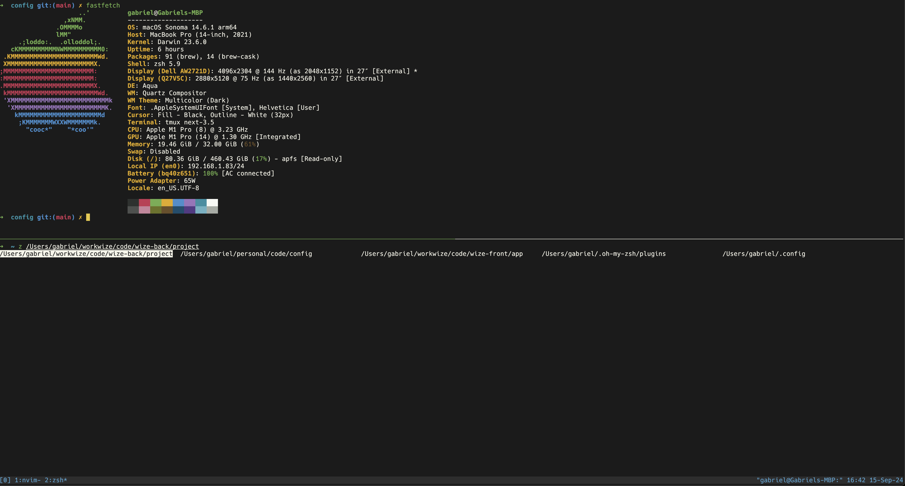
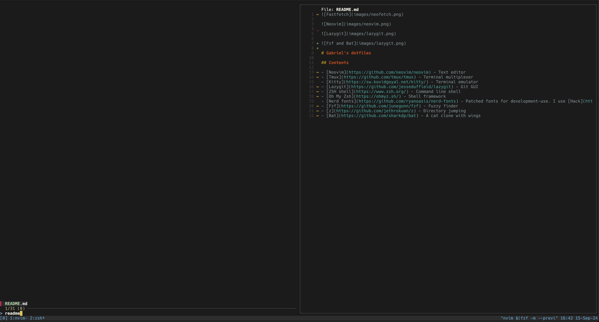

# Gabriel's dotfiles

## Contents

- [Neovim](https://github.com/neovim/neovim) - Text editor
- [Tmux](https://github.com/tmux/tmux) - Terminal multiplexer
- [Kitty](https://sw.kovidgoyal.net/kitty/) - Terminal emulator
- [Lazygit](https://github.com/jesseduffield/lazygit) - Git GUI
- [ZSH shell](https://github.com/zsh-users/zsh) - Command line shell
- [Oh My Zsh](https://github.com/ohmyzsh/ohmyzsh) - ZSH Shell framework
- [Nerd fonts](https://github.com/ryanoasis/nerd-fonts) - Patched fonts for development-use. I use [Hack](https://github.com/ryanoasis/nerd-fonts/tree/master/patched-fonts/Hack).
- [Fzf](https://github.com/junegunn/fzf) - Fuzzy finder
- [z](https://github.com/jethrokuan/z) - Directory jumping
- [Bat](https://github.com/sharkdp/bat) - A cat clone with wings
