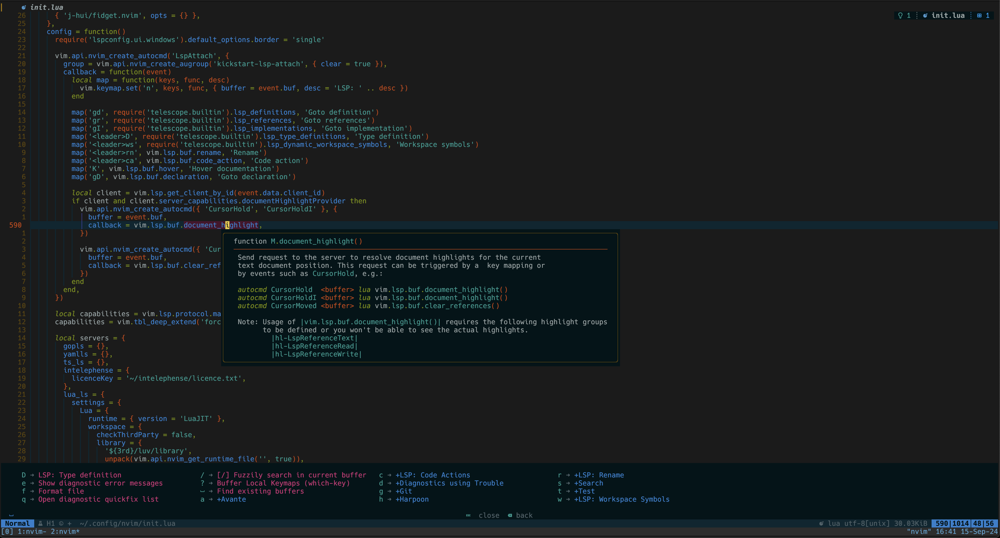

# Gabriel's dotfiles

## Contents

- neovim
- tmux
- fish
- iterm2
- lazygit

## Shell setup (macOS)

- [Iterm2](https://iterm2.com/) - Terminal emulator
- [Fish shell](https://fishshell.com/) - Command line shell
- [Fisher](https://github.com/jorgebucaran/fisher) - Plugin manager
- [Nerd fonts](https://github.com/ryanoasis/nerd-fonts) - Patched fonts for development-use. I use [Hack](https://github.com/ryanoasis/nerd-fonts/tree/master/patched-fonts/Hack).
- [z for fish](https://github.com/jethrokuan/z) - Directory jumping
